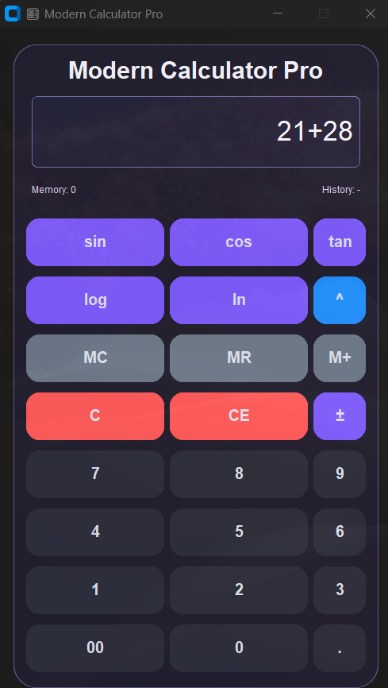
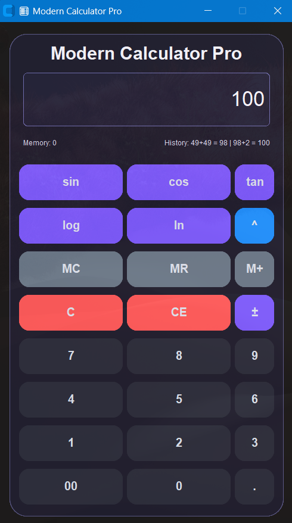

🧮 Modern Calculator
A modern GUI calculator built with Python and CustomTkinter. Features dark mode, keyboard support, and history tracking.

## 📸 Screenshots

| Feature | Preview |
|---------|---------|
| Main Window |  |
| Addition Demo |  |
| History |  |

 ✨ Features
- ✅ Dark/Light mode toggle
- ✅ Keyboard support (press 1,2,3,+,=)
- ✅ Memory functions (M+, M-, MR, MC)
- ✅ History of last 5 calculations
- ✅ Sound on button click
- ✅ Responsive design
- ✅ Glass Design
  
🛠️ Tech Stack
- Python 3.9+
- CustomTkinter
- Pygame (for sound)
- Pyperclip
