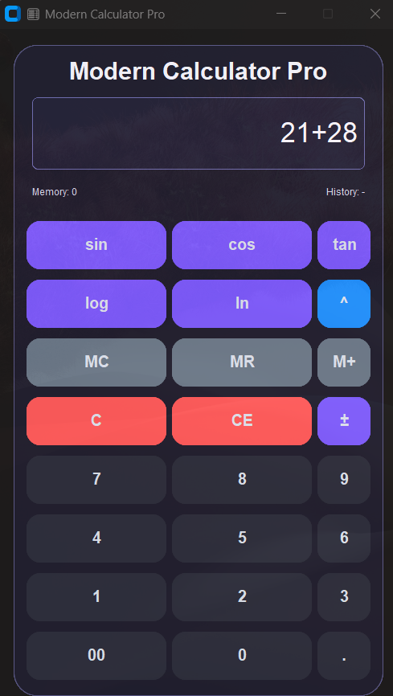
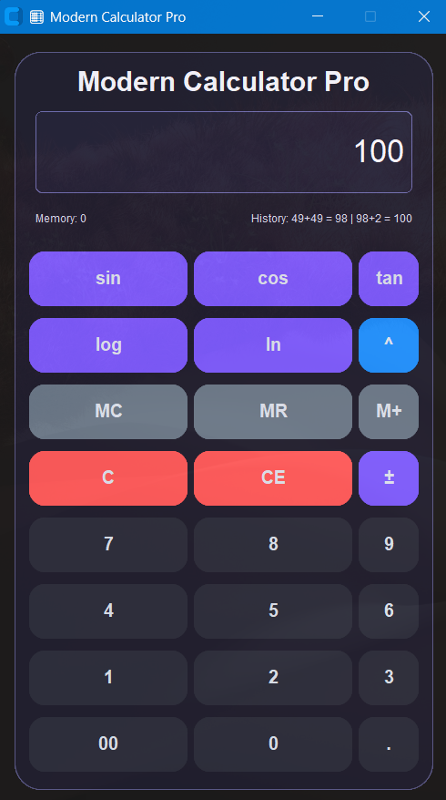

🧮 Modern Calculator
A modern GUI calculator built with Python and CustomTkinter. Features dark mode, keyboard support, and history tracking.

## 📸 Screenshots

| Feature | Preview |
| :--- | :--- |
| **Main Window** |  |
| **Addition Demo**|  |
| **History** |  |

 ✨ Features
- ✅ Dark/Light mode toggle
- ✅ Keyboard support (press 1,2,3,+,=)
- ✅ Memory functions (M+, M-, MR, MC)
- ✅ History of last 5 calculations
- ✅ Sound on button click
- ✅ Responsive design
- ✅ Glass Design
  
🛠️ Tech Stack
- Python 3.9+
- CustomTkinter
- Pygame (for sound)
- Pyperclip

---

## 🌅 The Mindset Approach
> *"Har din ek naya savera hai"* — One step at a time, building practical skills and learning how to protect digital environments effectively without taking unnecessary pressure. ✨

---

## ✍️ Let's Connect!

| Profile Details | Links & Networks |
| :--- | :--- |
| **Name** 🧑‍💻 | Harish Nirmalkar |
| **Education** 🎓 | MCA Student @ Rungta International Skills University |
| **Let's Talk** 💬 | Open for collaborations, learning discussions, or just a friendly hi! |
| **Professional** 💼 | [Connect on LinkedIn 🌐](https://linkedin.com/in/harish-nirmalkar-b23776394) |
